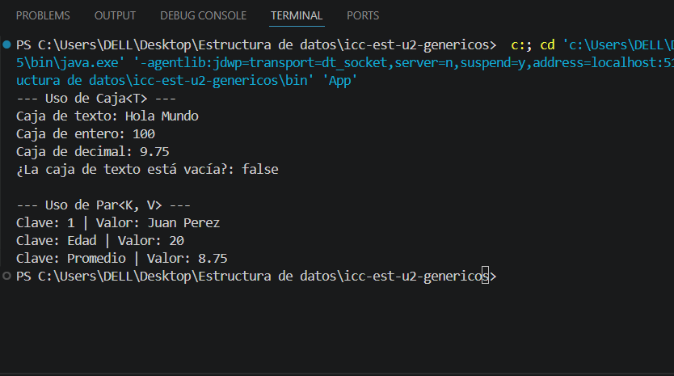
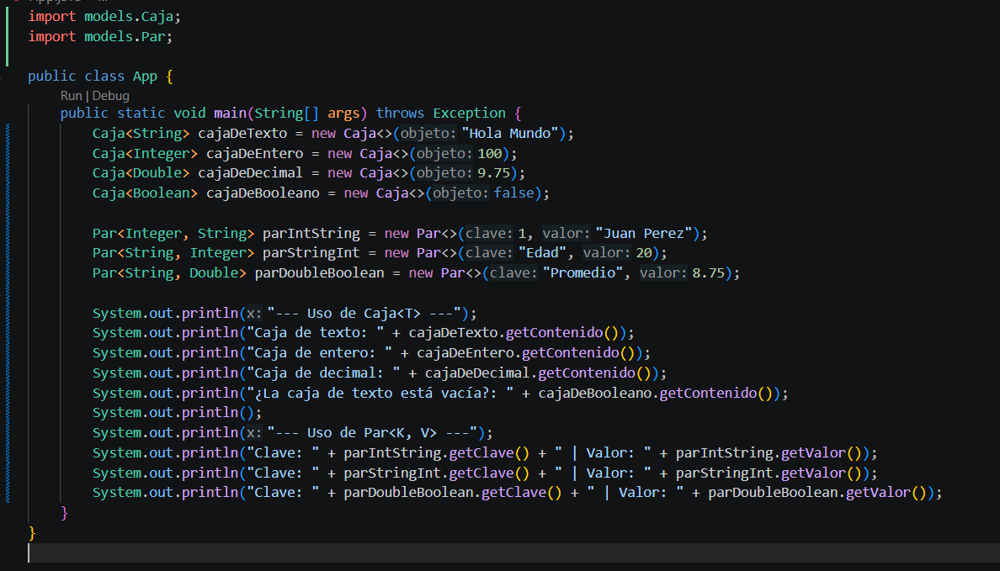

# Practica: Clases Genéricas en Java

## Datos del Estudiante
- **Nombre:** Ricardo Emilio Uzhca Benavides
- **Curso:** Grupo 1
- **Fecha:** 03/06/02026

---

## 1. Implementacion de Caja<T> Y Par<K, V>

**Fecha:** 03/06/2026

**Descripción:** En esta práctica se implementaron las clses genéricas Caja<T> Y Par<K, V> dentro del paquete models. La clase Caja<T> permite almacenar y obtener un dato de cualquier tipo, mientras que la clase Par<K, V> permite representar una ralacion entre una clave y un valor. En la captura se muestra la ejecucion del programa en consola con diferentes tipos de datos.

